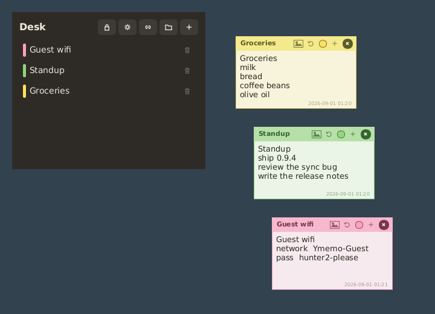
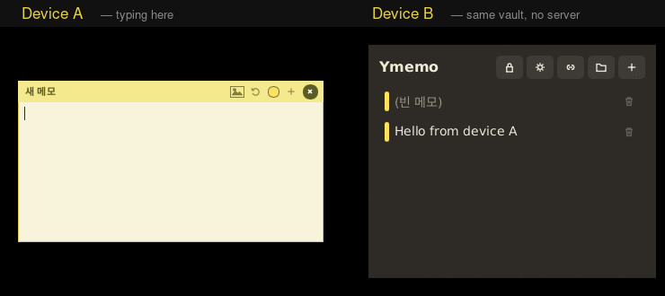
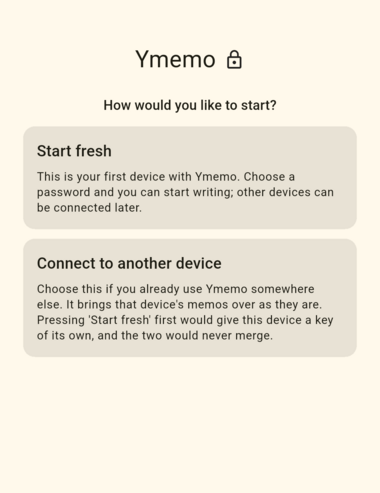
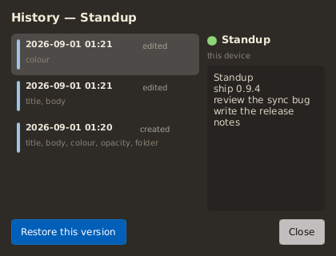
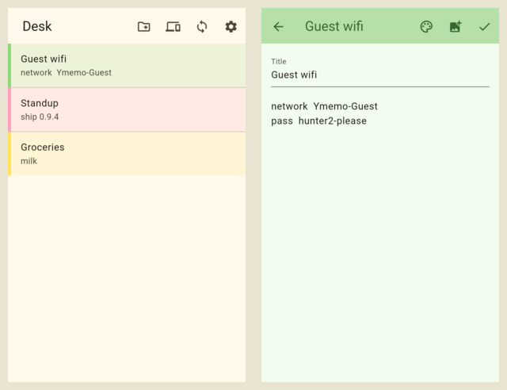

# Ymemo

[English](README.md) · **한국어**

책상에도 휴대폰에도 붙여 두는 메모. 내 기기들끼리 직접 동기화되고, 종단간 암호화되며,
**사이에 누구의 서버도 없고**, 가입할 계정도 없습니다.



- **내 것** — 기기마다 완전한 사본이 있고, 네트워크를 꺼도 그대로 동작합니다.
- **중간에 아무도 없음** — 기기끼리 직접 이야기합니다. 클라우드 계정이 없으니 해지할 것도,
  갑자기 잠길 것도 없습니다.
- **종단간 암호화** — 기기를 떠나는 것은 전부 암호문입니다. 마스터 비밀번호는 아예 기기를 떠나지
  않습니다.
- **무엇도 사라지지 않음** — 두 기기에서 동시에 고쳐도 한쪽이 이기는 대신 하나의 메모로
  합쳐집니다.



*연결된 두 기기, 하나의 보관함, 사이에는 아무것도 없습니다. 기다리는 구간은 줄여 놓았습니다 —
기본 설정에서는 20초쯤 걸리고, 설정 > 고급에서 배터리와 맞바꿔 더 빠르게 할 수 있습니다.*

## 받기

| | 내려받을 파일 | 참고 |
|---|---|---|
| **Windows** | `ymemo-<version>-setup-x86_64.exe` | 설치 프로그램. 트레이 앱과 방화벽 규칙을 함께 등록합니다. |
| **Debian / Ubuntu** | `ymemo_<version>_amd64.deb` | `sudo apt install ./ymemo_<version>_amd64.deb` |
| **Fedora** | `ymemo-<version>-*.x86_64.rpm` | `sudo dnf install ./ymemo-<version>-*.rpm` |
| **Android** | `ymemo-<version>-android-arm64-v8a.apk` | 대부분의 휴대폰이 `arm64-v8a`입니다. 스토어를 거치지 않으므로 설치 권한을 한 번 물어봅니다. |

전부 [릴리즈 페이지](https://github.com/PfClaKr/Ymemo/releases/latest)에 있습니다. 따로 설치할
것은 없습니다 — 동기화 데몬은 안에 들어 있습니다.

앱은 하루에 한 번쯤 새 버전이 있는지 확인하고, 있으면 **지금 쓰는 기기에 맞는 파일 하나만**
이름으로 알려 줍니다. 스스로 내려받거나 설치하는 일은 절대 없습니다. 자세한 것은 아래
[기기 밖으로 나가는 것](#기기-밖으로-나가는-것)을 보세요.

## 처음 시작할 때

처음 실행하면 앱이 딱 하나를 묻습니다. 이 답이 중요합니다:



- **새로 시작하기** — 첫 기기입니다. 마스터 비밀번호를 정하고 바로 쓰기 시작하세요.
- **다른 기기와 연결하기** — 이미 다른 곳에서 Ymemo를 쓰고 있습니다. 그 메모를 그대로
  가져옵니다. 여기서 '새로 시작하기'를 먼저 누르면 새 기기가 자기만의 열쇠를 갖게 되어 두
  기기는 영영 합쳐지지 않습니다.

보관함을 만들고 나면 **복구 코드**가 한 번 나옵니다. 마스터 비밀번호와 함께, 이 세상에서 당신의
메모를 열 수 있는 단 두 가지 중 하나입니다. 재설정 링크 같은 것은 없습니다 — 보내 줄 사람이
없으니까요.

제목을 눌러 보관함에 이름을 붙이세요(붙이기 전까지는 `Ymemo`입니다). 이름은 메모와 함께
다니므로, 연결한 모든 기기가 같은 이름을 보여줍니다.

## 무엇을 할 수 있나

### 메모답게 구는 메모

트레이 아이콘을 누르면 열려 있는 쪽지가 모두 앞으로 나오고, 메모 하나하나는 테두리 없는 작은
쪽지로 뜹니다. 치는 대로 저장되니 저장 버튼도, 창을 닫아서 잃을 것도 없습니다. 제목 줄을 두 번
누르면 그 줄만 남기고 접히고, 끌어다 놓으면 화면 가장자리와 다른 쪽지에 착 붙습니다. 여러 장을
붙여 두어도 무더기가 아니라 벽이 됩니다.

쪽지는 작업 표시줄에 남지 않습니다. 책상에 붙여 둔 여덟 장의 쪽지는 여덟 개의 프로그램이
아니니까요. 그리고 다른 창 **위**가 아니라 창들 사이에 놓입니다. 아래 있는 것을 읽으려고 치워야
하는 쪽지는 방해가 될 뿐이니까요. 제목 줄의 **압정**이 그 쪽지 하나를 모든 창 위로 올려 둡니다 —
일부러 계속 보이게 두려는 쪽지를 위한 것입니다. 뒤로 넘어간 나머지는 트레이로 다시 불러옵니다.
(작업 표시줄에서 감추는 것은 Windows와 X11에서만 됩니다. 네이티브 Wayland 세션에는 그렇게 요청할
방법이 없어서 거기서는 쪽지도 항목을 가집니다.)

쪽지마다 **색상**과 **투명도**를 따로 가지며, 둘 다 함께 동기화됩니다. 데스크톱에서 파랗게 만든
메모는 휴대폰에서도 파랗습니다. 쪽지에 글을 쓰는 동안에는 투명도가 잠시 풀렸다가 벗어나면
돌아오므로, 자기가 쓴 문장을 바탕화면 너머로 읽을 일은 없습니다.

### 종이 위의 사진

사진을 메모에 끌어다 놓고 원하는 자리로 옮기거나 크기를 바꾸세요. 크기는 픽셀이 아니라 글자
높이의 배수로 저장되기 때문에, 휴대폰에서 줄여 놓은 사진은 27인치 모니터에서 열어도 글에 대해
같은 크기로 보입니다.

사진도 다른 것처럼 암호화되고 내용으로 식별되어 저장되므로, 같은 사진을 두 기기에서 붙여도
파일은 하나로 남습니다.

### 폴더

중첩할 수 있고, 끌어다 옮길 수 있고, 자기 색을 가집니다. 데스크톱에서는 트리로 보이고,
휴대폰에서는 한 번에 한 폴더씩 들어갑니다 — 작은 화면이 감당할 수 있는 방식입니다. 폴더를
지워도 안에 있던 것은 한 단계 위로 올라올 뿐 사라지지 않습니다.

### 지나간 모든 버전

메모와 폴더의 모든 수정이 남습니다. 언제 바뀌었는지, 어느 기기가 바꿨는지, 그때 뭐라고
적혀 있었는지. 어느 버전으로든 되돌릴 수 있고, 되돌리는 것 자체가 또 하나의 수정이라서 지나쳐
온 것도 그대로 남습니다.



저장 공간은 더 들지 않습니다. 기기끼리 주고받는 암호화된 로그가 **곧** 기록이고, 앱은 그것을
다시 읽어 보여 줄 뿐입니다.

### 휴대폰에서

같은 메모, 같은 폴더, 같은 사진.



### 홈 화면에서

안드로이드 위젯 셋과, 앱 아이콘을 길게 눌러 쓰는 단축키 둘:

- **간편쓰기 바** — 누르면 바로 새 메모가 열리고, 카메라 버튼을 누르면 사진 선택창까지 함께
  열립니다.
- **포스트잇** — 메모 하나를 그 색 그대로 홈 화면에 붙여 둡니다. 직접 고른 메모여도 되고,
  마지막으로 쓴 메모를 따라가게 두어도 됩니다.
- **목록** — 폴더와 최근 메모를 모아 보고, 누르면 그 메모가 열립니다.

앱이 잠기는 순간 위젯은 비워집니다. 비밀번호로 가려 둔 것이 홈 화면에 남아 있으면 안 되니까요.

### 잠금

마스터 비밀번호, 즉시 잠그기, 자리를 비우면 자동 잠금, 그리고 원하면 정해 둔 일수 동안 잠금 해제
유지. 휴대폰에서는 다른 앱으로 넘어가는 순간 스스로 닫히고 앱 전환 화면에도 남지 않게 할 수
있으며, 비밀번호 대신 **지문**으로 다시 열 수도 있습니다 — 편의와 안전을 조금 맞바꾸는 일이고,
켜는 자리에서 그렇게 적어 두었습니다.

### 기기 연결

상대 기기의 QR을 찍거나 페어링 코드를 입력하세요. 상대 기기가 허용할지 묻고, 양쪽 화면에 같은
여덟 글자가 떠서 내가 연결하려던 그 기기가 맞는지 확인할 수 있습니다. 같은 네트워크에 있다면
6자리 숫자로 한 번에 연결됩니다. 연결한 기기는 나중에 어느 쪽에서든 해제할 수 있습니다.

### 한국어와 영어

시스템 언어를 따라가고 설정에서 바꿀 수 있습니다. 화면의 글과 코어의 오류 메시지가 같은
카탈로그에서 나오므로, 둘이 서로 다른 언어로 보이는 일은 없습니다.

## 기기 밖으로 나가는 것

메모는 암호문으로만, 연결해 둔 기기에만, 그 기기들끼리 맺은 연결로만 나갑니다.

앱이 남의 서버에 보내는 요청은 **딱 하나**입니다. 새 릴리즈가 있는지 GitHub에 하루 한 번 묻는
것. 보관함의 내용도, 기기 식별자도, 당신을 알아볼 수 있는 무엇도 담기지 않습니다 — 다만 IP
주소는 GitHub에 닿으므로, 설정에서 끌 수 있습니다.

두 기기가 서로 직접 닿지 못하면 동기화가 Syncthing의 공개 릴레이를 거칠 수 있습니다. 릴레이는
암호화된 바이트를 넘길 뿐 읽지 못합니다.

암호화가 무엇을 지키고 무엇을 지키지 않는지 — 각 기기의 로컬 캐시는 **평문**이라 잠금이 풀린
상태의 기기를 남이 읽을 수 있으면 숨겨지는 것이 없다는 점을 포함해 —
[SECURITY.md](SECURITY.md)에 적어 두었습니다.

---

## 안쪽 이야기

Rust 코어(`ymemo-core`)가 데이터 모델, 저장, 병합, 암호화를 전부 들고 있고, 그 위의 두 UI는
얇습니다. 데스크톱은 **Slint**(`ymemo-desktop`, 순수 Rust, 웹뷰 없음), 안드로이드는
**Flutter**(`apps/mobile`, `flutter_rust_bridge`로 코어에 닿음). 병합은 **Automerge**라서 두
기기가 각각 고쳐도 수정이 어떤 순서로 도착하든 같은 결과가 됩니다. 암호화는 **RustCrypto** —
XChaCha20-Poly1305와 Argon2id — 이고, 기기마다 두는 **SQLite** 캐시는 진실이 아니라 언제든 버릴
수 있는 사본입니다.

**Syncthing은 파일을 나르기만 하고 그 안의 내용은 전혀 신뢰받지 않습니다.** 함께 들어 있어서
따로 설치할 필요가 없고, 로컬 REST API로 조종합니다:

```
[ymemo-core]   메모, CRDT 병합, 종단간 암호화
      |        암호화된 변경 로그를 보관함 디렉터리에 씀
[Syncthing]    그 디렉터리를 기기 사이로 나름 (검색, NAT 통과, 릴레이, TLS)
```

```
vault/
├── vault.json              # Argon2id 솔트 + 감싼 데이터 키 + 키 확인용 값
├── logs/<device-id>.ymlog  # 기기별 추가 전용 암호화 로그. 한 레코드가 automerge 변경 하나
└── blobs/<sha256>.ymblob   # 첨부 사진, 암호화됨. 파일 이름이 내용 해시
```

두 가지 성질이 대부분의 일을 합니다. 로그와 블롭은 무작위 **데이터 키**로 암호화되고 마스터
비밀번호는 그 키를 *감싸기만* 하므로, 비밀번호를 바꿔도 작은 필드 하나만 다시 쓸 뿐 메모를 다시
암호화하지 않습니다. 그리고 각 기기는 **자기 로그에만** 덧붙이므로 두 기기가 같은 파일을 쓰는
일이 없습니다. 전송 계층에서는 충돌이 아예 생기지 않고, 내용은 CRDT가 합칩니다.

### 빌드

Rust **1.87 이상**, 리눅스에서는 `libfontconfig1-dev`(Slint가 fontconfig에 링크합니다)와 한글
표시를 위한 `fonts-noto-cjk`.

```bash
cargo test --workspace
cargo run -p ymemo-desktop
```

앱 데이터는 플랫폼 데이터 디렉터리(리눅스 `~/.local/share/ymemo`, 윈도우
`%APPDATA%\ymemo\Ymemo\data`)에 있고, 그중 암호화된 `vault/`만 동기화됩니다. 다른 곳에 두려면
`YMEMO_DATA_DIR`를 지정하세요 — 이동식 설치나, 실제로 쓰는 보관함을 건드리지 않고 빌드를 시험할
때 씁니다. `ymemo --purge`는 이 기기의 사본만 지우고 다른 기기에는 손대지 않습니다.

안드로이드 앱의 준비·빌드·시험 방법은 [apps/mobile/README.md](apps/mobile/README.md)에 따로
있습니다. 패키징 — `.deb`, `.rpm`, Inno Setup 설치 파일, ABI별 APK — 은 `packaging/` 아래에
스크립트로 있고 `v*` 태그에서
[.github/workflows/release.yml](.github/workflows/release.yml)이 만듭니다.

### 앞으로 할 것

- macOS: 트레이와 패키징
- iOS

### 라이선스

GPL-3.0-only
